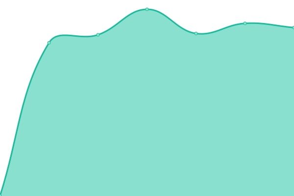
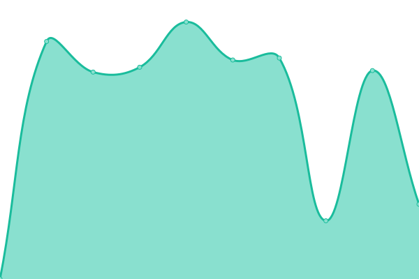
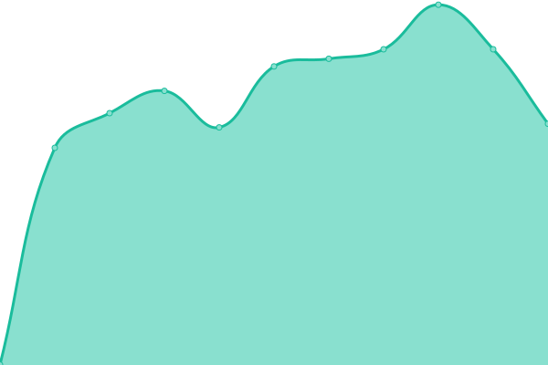
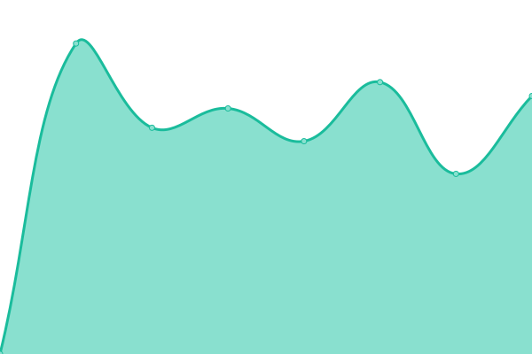
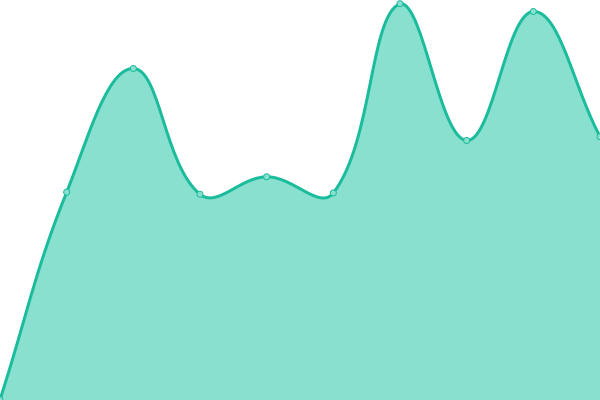
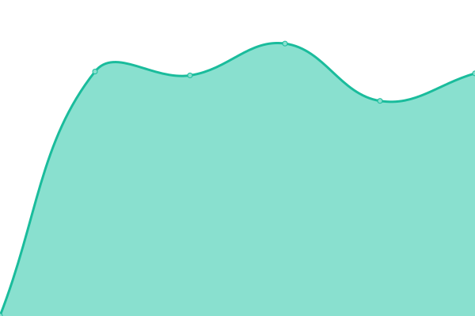

# [📈 Live Status](https://jcruse-erw.github.io/UptimeReport): <!--live status--> **🟩 All systems operational**

This repository contains the open-source uptime monitor and status page for [jcruse-erw](https://jcruse-erw.github.io/UptimeReport), powered by [Upptime](https://github.com/upptime/upptime).

With [Upptime](https://upptime.js.org), you can get your own unlimited and free uptime monitor and status page, powered entirely by a GitHub repository. We use [Issues](https://github.com/jcruse-erw/UptimeReport/issues) as incident reports, [Actions](https://github.com/jcruse-erw/UptimeReport/actions) as uptime monitors, and [Pages](https://jcruse-erw.github.io/UptimeReport) for the status page.

<!--start: status pages-->
<!-- This summary is generated by Upptime (https://github.com/upptime/upptime) -->
<!-- Do not edit this manually, your changes will be overwritten -->

| URL                                             | Status | History                                                                                                | Response Time                                                                     | Uptime                                                                                                                                                                                                                                   |
| ----------------------------------------------- | ------ | ------------------------------------------------------------------------------------------------------ | --------------------------------------------------------------------------------- | ---------------------------------------------------------------------------------------------------------------------------------------------------------------------------------------------------------------------------------------- |
| [erw](https://e-raumwerk.de)                    | 🟩 Up  | [erw.yml](https://github.com/jcruse-erw/UptimeReport/commits/master/history/erw.yml)                   |  1006ms         |                   |
| [syntax](https://syntax-systems.com)            | 🟩 Up  | [syntax.yml](https://github.com/jcruse-erw/UptimeReport/commits/master/history/syntax.yml)             |  2162ms      |              |
| [scnem](https://scnem.com)                      | 🟩 Up  | [scnem.yml](https://github.com/jcruse-erw/UptimeReport/commits/master/history/scnem.yml)               |  732ms        |                |
| [scnem2](https://scnem2.com)                    | 🟩 Up  | [scnem2.yml](https://github.com/jcruse-erw/UptimeReport/commits/master/history/scnem2.yml)             |  727ms       |              |
| [scnem3](https://scnem3.com)                    | 🟩 Up  | [scnem3.yml](https://github.com/jcruse-erw/UptimeReport/commits/master/history/scnem3.yml)             |  713ms       |              |
| [geb haus soe](http://www.geburtshaus-soest.de) | 🟩 Up  | [geb-haus-soe.yml](https://github.com/jcruse-erw/UptimeReport/commits/master/history/geb-haus-soe.yml) |  838ms |  |
| [audience](https://www.audience-soest.de)       | 🟩 Up  | [audience.yml](https://github.com/jcruse-erw/UptimeReport/commits/master/history/audience.yml)         |  2342ms    |          |
| [impu](https://www.impuls.com)                  | 🟩 Up  | [impu.yml](https://github.com/jcruse-erw/UptimeReport/commits/master/history/impu.yml)                 |  1570ms        |                 |
| [seeva](https://seeva.e-raumwerk.de)            | 🟩 Up  | [seeva.yml](https://github.com/jcruse-erw/UptimeReport/commits/master/history/seeva.yml)               |  1066ms       |               |

<!--end: status pages-->

[**Visit our status website →**](https://jcruse-erw.github.io/UptimeReport)

## 📄 License

- Code: [MIT](./LICENSE) © [jcruse-erw](https://jcruse-erw.github.io/UptimeReport)
- Data in the `./history` directory: [Open Database License](https://opendatacommons.org/licenses/odbl/1-0/)
