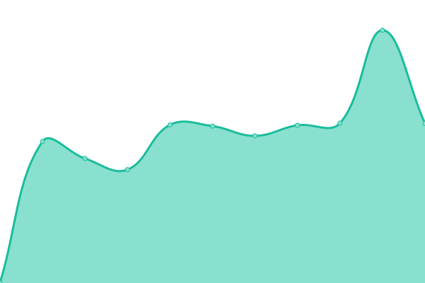
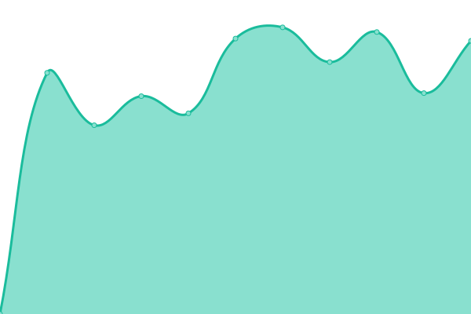

# [📈 Live Status](https://jcruse-erw.github.io/UptimeReport): <!--live status--> **🟧 Partial outage**

This repository contains the open-source uptime monitor and status page for [jcruse-erw](https://jcruse-erw.github.io/UptimeReport), powered by [Upptime](https://github.com/upptime/upptime).

With [Upptime](https://upptime.js.org), you can get your own unlimited and free uptime monitor and status page, powered entirely by a GitHub repository. We use [Issues](https://github.com/jcruse-erw/UptimeReport/issues) as incident reports, [Actions](https://github.com/jcruse-erw/UptimeReport/actions) as uptime monitors, and [Pages](https://jcruse-erw.github.io/UptimeReport) for the status page.

<!--start: status pages-->
<!-- This summary is generated by Upptime (https://github.com/upptime/upptime) -->
<!-- Do not edit this manually, your changes will be overwritten -->

| URL                                      | Status  | History                                                                                        | Response Time                                                                | Uptime                                                                                                                                                                                                                           |
| ---------------------------------------- | ------- | ---------------------------------------------------------------------------------------------- | ---------------------------------------------------------------------------- | -------------------------------------------------------------------------------------------------------------------------------------------------------------------------------------------------------------------------------- |
| [erw](https://e-raumwerk.de)             | 🟩 Up   | [erw.yml](https://github.com/jcruse-erw/UptimeReport/commits/master/history/erw.yml)           |  1019ms    |           |
| [syntax](https://syntax-systems.com)     | 🟩 Up   | [syntax.yml](https://github.com/jcruse-erw/UptimeReport/commits/master/history/syntax.yml)     |  2178ms |      |
| [scnem](https://scnem.com)               | 🟩 Up   | [scnem.yml](https://github.com/jcruse-erw/UptimeReport/commits/master/history/scnem.yml)       |  729ms   |        |
| [scnem2](https://scnem2.com)             | 🟩 Up   | [scnem2.yml](https://github.com/jcruse-erw/UptimeReport/commits/master/history/scnem2.yml)     |  754ms  |      |
| [scnem3](https://scnem3.com)             | 🟩 Up   | [scnem3.yml](https://github.com/jcruse-erw/UptimeReport/commits/master/history/scnem3.yml)     |  765ms  |      |
| [GBS](http://www.geburtshaus-soest.de)   | 🟩 Up   | [gbs.yml](https://github.com/jcruse-erw/UptimeReport/commits/master/history/gbs.yml)           |  817ms     |           |
| [Audience](http://www.audience-soest.de) | 🟥 Down | [audience.yml](https://github.com/jcruse-erw/UptimeReport/commits/master/history/audience.yml) |  0ms  |  |
| [imp](https://www.impuls.com)            | 🟩 Up   | [imp.yml](https://github.com/jcruse-erw/UptimeReport/commits/master/history/imp.yml)           |  1272ms    |           |
| [seeva](https://seeva.e-raumwerk.de)     | 🟩 Up   | [seeva.yml](https://github.com/jcruse-erw/UptimeReport/commits/master/history/seeva.yml)       |  1075ms  |       |

<!--end: status pages-->

[**Visit our status website →**](https://jcruse-erw.github.io/UptimeReport)

## 📄 License

- Code: [MIT](./LICENSE) © [jcruse-erw](https://jcruse-erw.github.io/UptimeReport)
- Data in the `./history` directory: [Open Database License](https://opendatacommons.org/licenses/odbl/1-0/)
